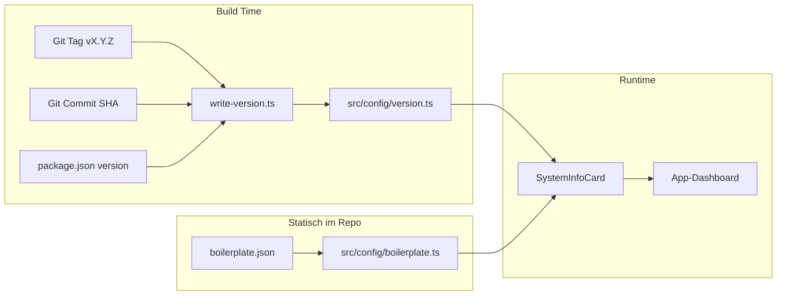

# App-Versionierung Feature (aktualisiert)

## Ausgangslage

- `package.json` hat `"version": "0.1.0"` (App-Version)
- `boilerplate.json` existiert bereits mit `"version": "1.1.0"` und `"name": "kessel-boilerplate"`
- App-Dashboard existiert als Placeholder
- `tsx` bereits als devDependency vorhanden

## Zwei-Ebenen-Versionierung

| Ebene | Quelle | Beispiel ||-------|--------|----------|| **App-Version** | Git-Tag / package.json | `0.3.0 (fa1eade4)` || **Boilerplate-Version** | boilerplate.json | `kessel-boilerplate@1.1.0` |

## Architektur



## Implementierung

### 1. Build-Script: `scripts/write-version.ts`

Logik:

- **App-Version**: Git-Tag `vX.Y.Z` -> `X.Y.Z`, Fallback: `package.json.version`, letzter Fallback: `0.0.0-dev`
- **Commit-SHA**: `VERCEL_GIT_COMMIT_SHA` (8 Zeichen) oder `git rev-parse --short HEAD`
- **Environment**: `VERCEL_ENV` oder `NODE_ENV` -> `development | preview | production`

Generiert `src/config/version.ts`:

```typescript
// AUTO-GENERATED BY scripts/write-version.ts - DO NOT EDIT
export const APP_VERSION = "0.3.0"
export const APP_BUILD_COMMIT = "fa1eade4"
export const APP_ENV: "development" | "preview" | "production" = "production"
```

### 2. Boilerplate-Config: `src/config/boilerplate.ts`

Statische Datei (committed, nicht generiert):

```typescript
import boilerplateInfo from "@/../boilerplate.json"

export const BOILERPLATE_NAME = boilerplateInfo.name
export const BOILERPLATE_VERSION = boilerplateInfo.version
```

Die bestehende [`boilerplate.json`](boilerplate.json) bleibt unverändert - hat bereits `name` und `version`.

### 3. SystemInfoCard: `src/components/admin/system-info-card.tsx`

Zeigt vier Informationen:

- App-Version + Commit
- Environment
- Boilerplate-Name + Version

Design: Nutzt bestehende Card, Badge, Design Tokens.

### 4. Dashboard-Integration

[`src/app/(shell)/app-verwaltung/app-dashboard/page.tsx`](<src/app/\\(shell)/app-verwaltung/app-dashboard/page.tsx>) importiert und zeigt SystemInfoCard.

### 5. package.json Scripts

```json
{
  "scripts": {
    "version:write": "tsx scripts/write-version.ts",
    "prebuild": "pnpm version:write && pnpm validate:ai",
    "build": "next build"
  }
}
```

### 6. .gitignore

Hinzufügen: `src/config/version.ts` (generiert)Nicht ignorieren: `boilerplate.json`, `src/config/boilerplate.ts` (committed)

### 7. Cursor Rule: `.cursor/rules/versioning.mdc`

Dokumentiert beide Versionsebenen und deren Verwendung.

## Dateien-Übersicht

| Datei | Aktion | Git ||-------|--------|-----|| `scripts/write-version.ts` | Neu | Committed || `src/config/version.ts` | Auto-generiert | Ignoriert || `src/config/boilerplate.ts` | Neu | Committed || `src/components/admin/system-info-card.tsx` | Neu | Committed || `src/app/(shell)/app-verwaltung/app-dashboard/page.tsx` | Erweitern | Committed || `package.json` | Scripts anpassen | Committed || `.gitignore` | Erweitern | Committed || `.cursor/rules/versioning.mdc` | Neu | Committed |

## Anzeige im Dashboard

```javascript
┌─────────────────────────────────┐
│ System                          │
├─────────────────────────────────┤
│ App-Version    │ 0.3.0 (fa1ea..)│
│ Environment    │ production     │
│ Boilerplate    │ kessel@1.1.0   │
└─────────────────────────────────┘
```

## Workflow-Dokumentation

**Boilerplate upgraden:**

```bash
# 1. Neues Boilerplate-Release ziehen
# 2. boilerplate.json manuell updaten (version)
# 3. Commit: "chore: upgrade boilerplate to 1.2.0"
```

**App releasen:**

```bash
# 1. Feature auf feature-branch
# 2. Merge nach main
# 3. Tag setzen
git tag -a v0.3.0 -m "Release 0.3.0: Feature X"
git push origin v0.3.0
# 4. Vercel deployt Tag -> Production


```
