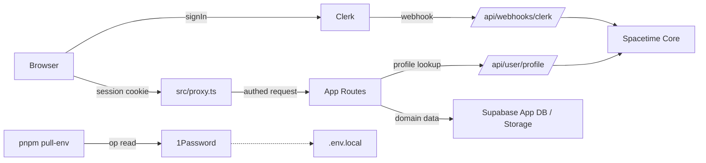

# Kessel Boilerplate 3.0 Cleanup

## Leitentscheidungen

- **Single-Tenant-Boilerplate**: Clerk Organizations werden aus dem Boilerplate-Code komplett entfernt. Ableitungen, die Multi-Tenancy wollen, schalten es bewusst selbst zu.
- **ADR-002 wird wortwoertlich umgesetzt**: Clerk = Identity, Spacetime = Core, Supabase = App-Daten/Storage, 1Password = Secrets. Keine Hybridpfade mehr.
- **Hard-Cutover**, kein Feature-Flag-Fallback. Alles was dem finalen Zustand widerspricht wird ersatzlos geloescht.

---

## Phase 0 - Baseline sichern (klein, zuerst)

- Git-Tag `pre-3.0-cutover` auf `main` setzen.
- Aktuellen Stand kurz verifizieren: `pnpm lint`, `pnpm test:run`, `pnpm build` als Ist-Protokoll in `docs/06_history/baseline-pre-3.0-cutover.md`.

## Phase 1 - Clerk Single-Tenant sauber

Zielzustand: Clerk ist Pflicht, ohne Publishable Key bootet die App gar nicht. Keine Organizations, keine Email-Allowlist, keine deutschsprachigen Ableitungs-Pfade im Matcher.

- [src/app/layout.tsx](src/app/layout.tsx): Den `NEXT_PUBLIC_CLERK_PUBLISHABLE_KEY`-Fallback-Zweig (Zeilen 162-191) entfernen. `ClerkProvider` wird bedingungslos gerendert; Validierung uebernimmt [src/env.mjs](src/env.mjs), wo `NEXT_PUBLIC_CLERK_PUBLISHABLE_KEY` und `CLERK_SECRET_KEY` von `optional()` auf required wechseln.
- [src/proxy.ts](src/proxy.ts):
  - `isClerkTaskRoute` loeschen, `treatPendingAsSignedOut: false` raus (Default akzeptieren), da ohne Organizations keine pending-Sessions mehr entstehen.
  - `config.matcher` generisch machen: Boilerplate kennt nur `/`, `/login(.*)`, `/signup(.*)`, `/verify(.*)`, `/wiki`, `/llms.txt`, `/.well-known/:path*`, `/api/((?!webhooks).*)`. Die deutschen Pfade (`/app-verwaltung`, `/benutzer-menue`, `/ueber-die-app`) wandern in eine Ableitungs-Hook-Datei oder entfallen komplett, falls sie nicht zum Boilerplate-Scope gehoeren.
- [src/app/(auth)/login/page.tsx](<src/app/(auth)/login/page.tsx>) und `signup/page.tsx`: Die hart kodierten Hex-Farben im `appearance`-Objekt durch CSS-Variablen-Referenzen ersetzen (`"hsl(var(--primary))"` etc.). Neue shared Helper-Datei `src/lib/auth/clerk-appearance.ts`, die beide Seiten nutzen.
- [src/app/api/webhooks/clerk/route.ts](src/app/api/webhooks/clerk/route.ts):
  - Die vier Organization-Events (`organization.created`, `organizationMembership.created`, `organizationMembership.deleted` und die impliziten Update-Pfade) ersatzlos entfernen.
  - `resolveProvisioningRole` + `coreStore.listUsers()` durch einen schlanken Default-Role-Mechanismus ersetzen (z.B. erster User -> `admin`, weitere -> `user`, entscheidbar via Spacetime-Reducer).
  - Nur noch `user.created`, `user.updated`, `user.deleted` behandeln.
- [src/components/auth/auth-context.tsx](src/components/auth/auth-context.tsx): Die Email-Allowlist-Fallbacks raus (`getAllowedRoleForEmail`). Wenn `/api/user/profile` nichts liefert, bleibt der User unauthorisiert - kein Schatten-Profil aus Email-Pattern. Die Modul-Singleton-Dedup fuer `profileRequest` bleibt, wird aber zu React-Query oder einem kleinen internen Hook gehoben, um nicht in einer globalen Variable zu leben.
- Loeschen: [src/lib/auth/allowed-users.ts](src/lib/auth/allowed-users.ts), [src/lib/auth/known-roles-cache.ts](src/lib/auth/known-roles-cache.ts) soweit nur fuer Allowlist genutzt.
- Docs: [docs/04_knowledge/clerk-setup.md](docs/04_knowledge/clerk-setup.md) neu schreiben. Secrets-Weg steht ausschliesslich ueber 1Password + `pnpm pull-env`. `supabase secrets set` raus.

## Phase 2 - Profile-API und Auth-Guards vereinfachen

- [src/app/api/user/profile/route.ts](src/app/api/user/profile/route.ts) auf den Pfad `Clerk auth() -> Spacetime getUserByClerkId -> einmaliger Upsert falls User-Created-Webhook noch nicht durch ist` reduzieren. Kein Email-Allowlist-Gate, keine Sonderfaelle.
- [src/lib/auth/guards.ts](src/lib/auth/guards.ts) und [src/components/auth/RoleGuard.tsx](src/components/auth/RoleGuard.tsx) auf den schlanken Kern pruefen: nur noch "hat Rolle X" gegen Spacetime-Profil. Redundanzen mit [src/components/auth/permissions-context.tsx](src/components/auth/permissions-context.tsx) zusammenfuehren oder eine der beiden Ebenen entfernen.

## Phase 3 - Supabase-Legacy-Core entfernen

Ziel: Keine produktiven Reads/Writes gegen `profiles`, `roles`, `module_role_access`, `app_settings`, `user_tenants`, `clerk_org_tenant_mapping`. Nur Spacetime spricht Core.

- Verbotene Muster-Sweep (Grundlage: Liste aus ADR-002, Abschnitt "Repo-weite Suchliste"): Treffer in [src/app/api/webhooks/clerk/route.ts](src/app/api/webhooks/clerk/route.ts), [src/proxy.ts](src/proxy.ts), [src/lib/auth/get-authenticated-user.ts](src/lib/auth/get-authenticated-user.ts), [src/lib/ai-chat/boilerplate-tools.ts](src/lib/ai-chat/boilerplate-tools.ts) pruefen und auf `getCoreStore()` umstellen.
- Migrationen 032-036 (Clerk-Profiles-FKs, Org-Tenant-Mapping) in [supabase/migrations/](supabase/migrations/): als "deprecated, nur fuer bestehende Ableitungen lesbar" markieren und in `supabase/migrations/_legacy/` verschieben. Im Boilerplate-Reset-Workflow werden sie nicht mehr angewandt.
- [src/app/layout.tsx](src/app/layout.tsx) `getDefaultThemeCSS()` bleibt auf Supabase Storage (Assets gehoeren dort hin, siehe ADR-002), aber `loadAppMetadata()` muss gegen Spacetime laufen, nicht mehr Supabase `app_settings`.

## Phase 4 - Secrets-Pfad auf 1Password

- [docs/04_knowledge/secrets-management.md](docs/04_knowledge/secrets-management.md) als Single Source of Truth, `TEMP_secrets-fallstricke.md` einarbeiten und loeschen.
- [scripts/pull-env.mjs](scripts/pull-env.mjs) und [scripts/pull-env.manifest.json](scripts/pull-env.manifest.json): Clerk-Keys, Supabase-Bootstrap, Spacetime-URI vollstaendig drin, Supabase-Vault-Fetch raus.
- [.cursor/rules/prohibitions.mdc] bleibt wie ist (verlangt bereits 1Password-Workflow).

## Phase 5 - Struktur-Hygiene

- Doppelte Docs-Ordner konsolidieren:
  - `docs/architecture/` -> vollstaendig in `docs/02_architecture/` aufgehen lassen.
  - `docs/guides/` -> in `docs/04_knowledge/` (Guides sind dort thematisch korrekt).
  - `docs/specifications/` -> Specs, die umgesetzt sind, nach `docs/03_features/`; offene Pitches (z.B. `ai-interactable-pr-pitch.md`) in `docs/05_communication/` oder loeschen.
  - `docs/knowledge/` vs. `docs/04_knowledge/` angleichen.
- Root-Cleanup: [IMPLEMENTATION_SUMMARY.md](IMPLEMENTATION_SUMMARY.md) in `docs/06_history/`, [schema_umbau.md](schema_umbau.md) ebenfalls nach History oder loeschen, [CHANGELOG.md](CHANGELOG.md) ins Root behalten (Konvention), [boilerplate.json](boilerplate.json) + [template.manifest.json](template.manifest.json) + [ai-manifest.json](ai-manifest.json) pruefen ob noch aktiv.
- `src/_archive/` aus dem Source-Tree loeschen (Git-History reicht).
- `scripts/` ausmisten:
  - Die vier Migration-018-Varianten (`apply-ai-datasources-migration`, `execute-migration-018`, `execute-migration-direct`, `execute-migration-via-api`, `execute-migration-via-pg`, `run-migration-018`, `run-migration-via-pg`, `verify-migration-018`) auf genau eines konsolidieren oder loeschen, da Migration laengst durch ist.
  - `test-*.mjs` / `test-*.ts` im Root von `scripts/` in `scripts/__tests__/` verschieben oder loeschen wenn veraltet.
  - `save-kessel-credentials.mjs`, `save-openrouter-key.mjs`, `backfill-clerk-profiles.mjs`, `migrate-schema-to-tenant.mjs`, `TEMP_cleanup-test-users.ts`: pruefen ob einmalige Migrations-Scripts -> loeschen.

## Phase 6 - Verifikation

- `pnpm lint`, `pnpm test:run`, `pnpm build` gruen.
- `pnpm validate:ai` gruen.
- Manueller E2E-Login-Durchlauf mit Chrome DevTools MCP: `/login` -> Clerk -> Redirect `/`, `/logout` -> `/login`.
- `pnpm dev` Kaltstart gegen frische `.env.local` aus `pnpm pull-env` -> kein "Clerk nicht konfiguriert" mehr moeglich, weil env-Validierung vorher greift.

## Datenfluss im Zielzustand

## Risiken und Mitigation

- Das Entfernen von Clerk Organizations bricht Ableitungen, die schon auf Organizations gebaut haben. **Mitigation**: Phase 0 Tag + kurze Migrations-Notiz in `docs/04_knowledge/clerk-migration-rollback.md` ergaenzen.
- Profile-API ohne Allowlist laesst zunaechst alle Clerk-registrierten User rein. **Mitigation**: Dokumentieren, dass Clerk-Seite (Dashboard-Restrictions, Waitlist) jetzt der Gatekeeper ist. Das ist bewusst - die Allowlist im Code war eine Notloesung.
- Supabase-Migrationen nach `_legacy/` verschieben kann bei frischen Ableitungen stoeren. **Mitigation**: README in `supabase/migrations/_legacy/` dokumentiert, welche nur fuer Pre-3.0-Ableitungen relevant sind.
