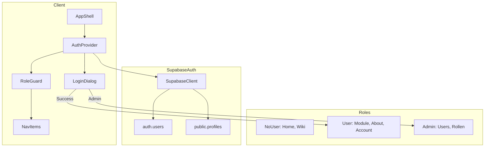

# Kessel Supabase Auth & User Management

## Ausgangslage

- Aktuell: Demo-Auth mit LocalStorage in [`src/components/auth/auth-context.tsx`](src/components/auth/auth-context.tsx)
- 3 bestehende Migrationen: Vault, Themes, User-Interactions
- Navigation hat bereits `requiredRoles` Support

## Phase 1: Supabase Organisation & Projekt Setup

### 1.1 Neue Organisation erstellen

```bash
supabase orgs create "Kessel"
```

### 1.2 Neues Projekt erstellen

```bash
supabase projects create "Kessel" --org-id <ORG_ID> --region eu-central-1
```

### 1.3 Projekt lokal verknuepfen

- Bestehende `.env` Datei sichern
- Neue Credentials vom Kessel-Projekt eintragen
- `supabase link --project-ref <PROJECT_REF>` ausfuehren

### 1.4 Migrationen zum neuen Projekt pushen

```bash
supabase db push
```

Dies uebertraegt alle 3 bestehenden Migrationen.

### Test Phase 1

- Supabase Dashboard oeffnen, pruefen ob alle Tabellen existieren
- Theme-API testen (`/api/themes/list`)

---

## Phase 2: Auth-Datenbank Setup

### 2.1 Neue Migration: User Profiles & Roles

Neue Datei: `supabase/migrations/004_auth_profiles.sql`

```sql
-- User Profiles Tabelle (erweitert auth.users)
CREATE TABLE public.profiles (
  id UUID REFERENCES auth.users(id) ON DELETE CASCADE PRIMARY KEY,
  email TEXT NOT NULL,
  display_name TEXT,
  avatar_url TEXT,
  role TEXT NOT NULL DEFAULT 'user' CHECK (role IN ('admin', 'user')),
  created_at TIMESTAMPTZ DEFAULT NOW(),
  updated_at TIMESTAMPTZ DEFAULT NOW()
);

-- RLS aktivieren
ALTER TABLE public.profiles ENABLE ROW LEVEL SECURITY;

-- Policies
CREATE POLICY "Users can view own profile" ON public.profiles
  FOR SELECT USING (auth.uid() = id);

CREATE POLICY "Users can update own profile" ON public.profiles
  FOR UPDATE USING (auth.uid() = id);

CREATE POLICY "Admins can view all profiles" ON public.profiles
  FOR SELECT USING (
    EXISTS (SELECT 1 FROM public.profiles WHERE id = auth.uid() AND role = 'admin')
  );

-- Trigger: Auto-create profile on signup
CREATE OR REPLACE FUNCTION public.handle_new_user()
RETURNS TRIGGER AS $$
BEGIN
  INSERT INTO public.profiles (id, email, display_name, role)
  VALUES (
    NEW.id,
    NEW.email,
    COALESCE(NEW.raw_user_meta_data->>'display_name', split_part(NEW.email, '@', 1)),
    COALESCE(NEW.raw_user_meta_data->>'role', 'user')
  );
  RETURN NEW;
END;
$$ LANGUAGE plpgsql SECURITY DEFINER;

CREATE TRIGGER on_auth_user_created
  AFTER INSERT ON auth.users
  FOR EACH ROW EXECUTE FUNCTION public.handle_new_user();
```

### 2.2 Migration ausfuehren

```bash
supabase db push
```

### Test Phase 2

- In Supabase Dashboard: Authentication > Users anschauen
- Pruefen ob `profiles` Tabelle existiert

---

## Phase 3: Supabase Auth Provider

### 3.1 Supabase Client aktualisieren

Bestehende Datei pruefen/erweitern: [`src/utils/supabase/client.ts`](src/utils/supabase/client.ts)

### 3.2 Auth-Context auf Supabase umstellen

[`src/components/auth/auth-context.tsx`](src/components/auth/auth-context.tsx) komplett neu schreiben:

```typescript
// Kern-Aenderungen:
export type UserRole = "admin" | "user" | "NoUser"

// Supabase Auth statt LocalStorage
// onAuthStateChange Listener
// Profile aus profiles-Tabelle laden
// hasRole() Funktion behalten
```

### 3.3 Dev-Bypass fuer lokale Entwicklung

ENV-Variable in `.env.local`:

```
NEXT_PUBLIC_AUTH_BYPASS=true
NEXT_PUBLIC_AUTH_BYPASS_ROLE=admin
```

Im Auth-Context:

```typescript
// Am Anfang des Providers pruefen
if (process.env.NEXT_PUBLIC_AUTH_BYPASS === "true") {
  // Simuliere eingeloggten User ohne echtes Auth
  const bypassRole = process.env.NEXT_PUBLIC_AUTH_BYPASS_ROLE || "admin"
  return {
    user: { id: "dev", email: "dev@localhost", role: bypassRole },
    isAuthenticated: true,
    role: bypassRole,
    isLoading: false,
    // ... rest
  }
}
```

Vorteile:

- Lokale Entwicklung ohne Supabase-Verbindung moeglich
- Schnelles Testen verschiedener Rollen durch Aendern der ENV-Variable
- In Production wird Bypass automatisch ignoriert (Variable nicht gesetzt)

### 3.4 Server-Side Auth Helper

Neue Datei: `src/lib/auth/server.ts` fuer Server Components

### Test Phase 3

- Mit `NEXT_PUBLIC_AUTH_BYPASS=true`: Automatisch als Admin eingeloggt
- Mit `NEXT_PUBLIC_AUTH_BYPASS=false`: Normaler Supabase Auth Flow
- Login mit Supabase Auth testen (Magic Link oder Passwort)
- Console pruefen ob User-Daten geladen werden
- Role korrekt aus `profiles` Tabelle

---

## Phase 4: Login UI mit ShadCN Blocks

### 4.1 ShadCN UI Blocks installieren

```bash
npx shadcn@latest add login-01
npx shadcn@latest add signup-01
npx shadcn@latest add otp-01
```

Diese Blocks erstellen fertige Komponenten:

- `src/components/login-form.tsx` - Login mit Email/Password
- `src/components/signup-form.tsx` - Registrierung
- `src/components/otp-form.tsx` - OTP/Magic Link Verifizierung

### 4.2 Auth-Seiten erstellen

Neue Route-Struktur:

- `src/app/(auth)/login/page.tsx` - Login-Seite mit LoginForm
- `src/app/(auth)/signup/page.tsx` - Signup-Seite mit SignupForm
- `src/app/(auth)/verify/page.tsx` - OTP-Verifizierung (Magic Link)
- `src/app/(auth)/layout.tsx` - Zentriertes Layout ohne AppShell

### 4.3 Blocks mit Supabase Auth verbinden

Die ShadCN Blocks anpassen:

- `onSubmit` Handler mit `supabase.auth.signInWithPassword()`
- `supabase.auth.signUp()` fuer Registrierung
- `supabase.auth.verifyOtp()` fuer Magic Link
- Error-States und Loading-States

### 4.4 Login-Redirect in AppShell

[`src/components/shell/AppShell.tsx`](src/components/shell/AppShell.tsx) erweitern:

- Wenn `role === "NoUser"` UND Route nicht oeffentlich -> Redirect zu `/login`
- Nach Login -> Redirect zurueck zur urspruenglichen Route

### Test Phase 4

- `/login` Seite aufrufen, Login testen
- `/signup` Seite aufrufen, Registrierung testen
- Nicht eingeloggt auf geschuetzte Route -> Redirect zu `/login`
- Nach Login -> Redirect zurueck

---

## Phase 5: RBAC & Route Protection

### 5.1 Navigation Rollen anpassen

[`src/config/navigation.ts`](src/config/navigation.ts):

```typescript
// Rollen vereinfachen auf: admin, user, NoUser

// Oeffentliche Seiten (NoUser darf sehen):
// - Home (/)
// - App-Wiki (/about/wiki)

// User-Seiten (user, admin):
// - Alle Module
// - About-Bereich
// - Account (ausser Users/Rollen)

// Admin-Seiten:
// - Account > Users
// - Account > Rollen
```

### 5.2 RoleGuard aktualisieren

[`src/components/auth/RoleGuard.tsx`](src/components/auth/RoleGuard.tsx):

- Auf neue Rollen anpassen
- Fallback: Login-Dialog statt verstecken

### 5.3 Protected Routes Middleware (optional)

Neue Datei: `src/middleware.ts` fuer Server-Side Route Protection

### Test Phase 5

- Als NoUser: Nur Home + Wiki sichtbar
- Als User: Alle Module sichtbar
- Als Admin: Users/Rollen sichtbar

---

## Phase 6: Finales Testing & Cleanup

### 6.1 Auth-Flows testen

- Registrierung
- Login (Email/Password)
- Logout
- Session-Persistenz (Page Reload)

### 6.2 RBAC testen

- NoUser: Zugriff auf geschuetzte Seiten -> Login-Dialog
- User: Zugriff auf Admin-Seiten -> versteckt/redirect
- Admin: Voller Zugriff

### 6.3 Alte Zepta-Referenzen entfernen

- ENV-Variablen auf Kessel-Projekt umstellen
- Alte Projekt-IDs entfernen

### 6.4 Dokumentation aktualisieren

- README mit Auth-Setup
- Secrets-Management Doku aktualisieren

---

## Architektur-Diagramm



## Dateien die erstellt/geaendert werden

| Datei | Aktion |

|-------|--------|

| `supabase/migrations/004_auth_profiles.sql` | Neu |

| `src/components/login-form.tsx` | Neu (via shadcn add login-01) |

| `src/components/signup-form.tsx` | Neu (via shadcn add signup-01) |

| `src/components/otp-form.tsx` | Neu (via shadcn add otp-01) |

| `src/app/(auth)/login/page.tsx` | Neu |

| `src/app/(auth)/signup/page.tsx` | Neu |

| `src/app/(auth)/verify/page.tsx` | Neu |

| `src/app/(auth)/layout.tsx` | Neu |

| `src/components/auth/auth-context.tsx` | Umschreiben |

| `src/components/auth/RoleGuard.tsx` | Anpassen |

| `src/components/shell/AppShell.tsx` | Erweitern |

| `src/config/navigation.ts` | Rollen anpassen |

| `src/lib/auth/server.ts` | Neu (optional) |

| `src/middleware.ts` | Neu (optional) |

| `.env` / `.env.local` | Neue Credentials |
