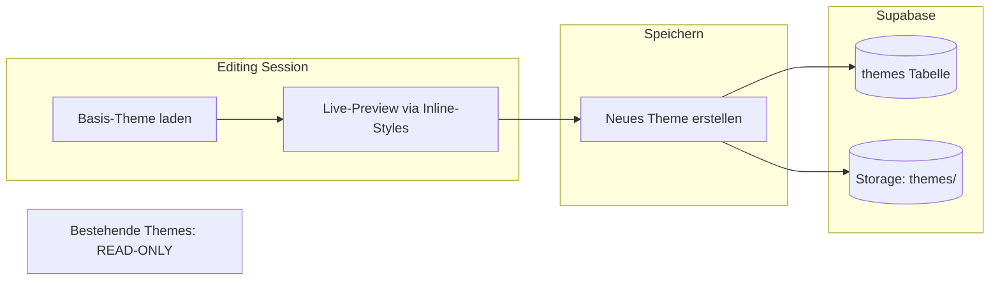
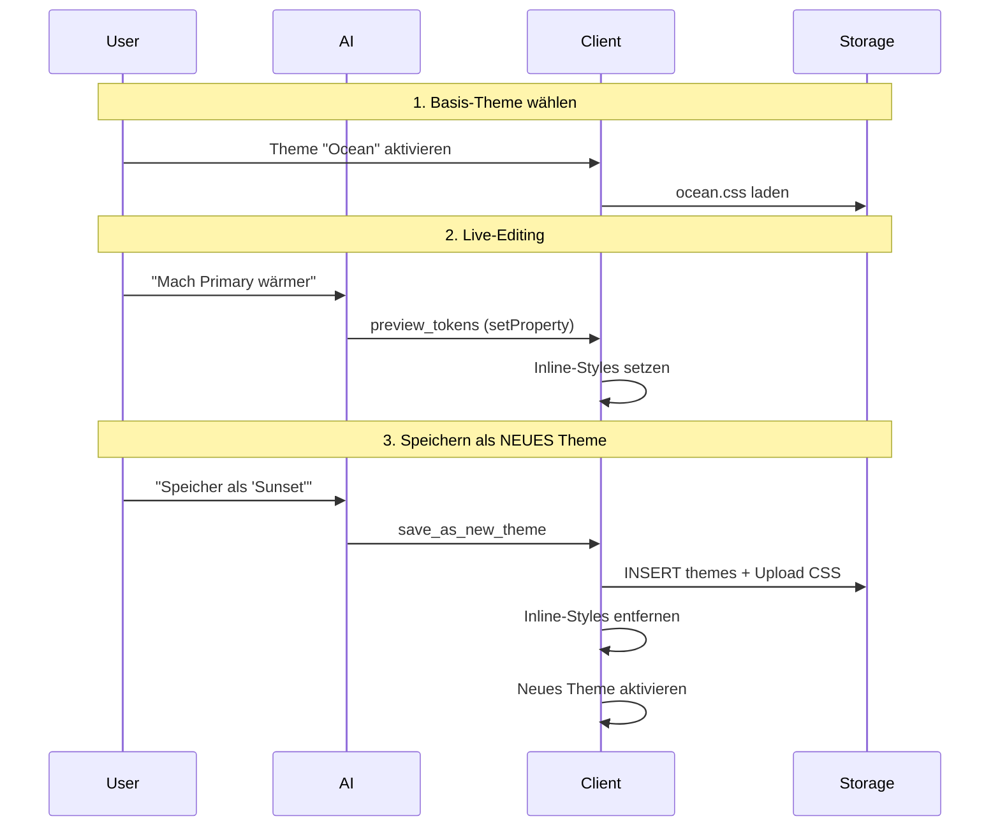

# Live Theme Editor (CSS-Only, Non-Destructive)

## Kernprinzip: "Save as New"



**Regeln:**

- Bestehende Themes werden NIE überschrieben
- "Speichern" = Neues Theme mit eigenem Namen/ID erstellen
- Live-Änderungen existieren nur als temporäre Inline-Styles
- Browser-Refresh = Änderungen verloren (bis gespeichert)

## Architektur

### Datenmodell

Die `themes` Tabelle bleibt unverändert. Neues Theme bei Speicherung:

```sql
INSERT INTO themes (id, name, description, is_builtin, created_by)
VALUES ('mein-warmes-theme', 'Mein warmes Theme', 'Basiert auf Ocean', false, auth.uid());
```

### Workflow



## Komponenten

### 1. Theme Editor Hook

[`src/hooks/use-theme-editor.ts`](src/hooks/use-theme-editor.ts)

```typescript
interface ThemeEditorState {
  baseThemeId: string | null // Welches Theme als Basis dient
  pendingChanges: Map<string, { light: string; dark: string }>
  isDirty: boolean // Gibt es ungespeicherte Änderungen?
}

interface ThemeEditorActions {
  startEditing(themeId: string): void // Basis-Theme setzen
  previewToken(name: string, light: string, dark: string): void
  resetPreview(): void // Zurück zum Basis-Theme
  saveAsNewTheme(name: string, description?: string): Promise<string> // Returns new theme ID
  getCurrentTokens(): Record<string, { light: string; dark: string }>
}
```

### 2. AI Theme Tools

[`src/lib/ai/theme-tools.ts`](src/lib/ai/theme-tools.ts)| Tool | Beschreibung ||------|-------------|| `get_theme_tokens` | Liest Token-Werte des aktuell aktiven Themes || `preview_theme_tokens` | Setzt Live-Preview (temporär, nicht persistent) || `reset_theme_preview` | Verwirft alle Änderungen, zurück zum Basis-Theme || `save_as_new_theme` | Erstellt NEUES Theme aus aktuellen Änderungen |**Wichtig:** Kein `update_theme` Tool! Überschreiben ist nicht möglich.

### 3. Save Dialog

Beim Speichern muss der User:

- Namen für das neue Theme eingeben
- Optional: Beschreibung
- Das neue Theme wird automatisch aktiviert

### 4. Einfache Token-Editor UI

[`src/components/theme/TokenEditor.tsx`](src/components/theme/TokenEditor.tsx)

- Zeigt alle bearbeitbaren Tokens mit Color-Pickern
- "Dirty"-Indikator wenn ungespeicherte Änderungen existieren
- "Speichern als..." Button öffnet Dialog für neuen Theme-Namen
- "Zurücksetzen" Button verwirft alle Änderungen

## Multi-User Aspekte

| Szenario | Verhalten ||----------|-----------|| User A editiert Theme X | Nur A sieht die Inline-Style-Änderungen || User A speichert als "Theme Y" | Neues Theme Y gehört User A || User B lädt die Seite | Sieht Theme Y in der Liste (wenn öffentlich) || User B will Theme Y editieren | B erstellt eigenes neues Theme basierend auf Y |**RLS-Policies:**

- `SELECT`: Alle können alle Themes sehen
- `INSERT`: Authentifizierte User können neue Themes erstellen
- `UPDATE`: Nur eigene, nicht-builtin Themes (für Metadaten wie Name)
- `DELETE`: Nur eigene, nicht-builtin Themes

## Dateien

| Datei | Änderung ||-------|----------|| `src/hooks/use-theme-editor.ts` | Neu: Theme-Editor State + Actions || `src/lib/ai/theme-tools.ts` | Neu: AI Tools (get, preview, reset, save_as_new) || `src/lib/ai/special-tools.ts` | Import + Export der Theme-Tools || `src/components/shell/AIChatPanel.tsx` | `__theme_action` Handler || `src/components/theme/TokenEditor.tsx` | Neu: Manual Editor UI || `src/components/theme/SaveThemeDialog.tsx` | Neu: Dialog für neuen Theme-Namen || `src/app/(shell)/themes/manager/page.tsx` | Integration TokenEditor + SaveDialog |

## Beispiel-Interaktionen

**AI-gesteuert:**

```javascript
User: "Mach die App wärmer, mehr Orange"
AI: [preview_theme_tokens] → Live-Vorschau
AI: "Ich habe Primary und Accent auf Orange-Töne geändert.
     Soll ich das als neues Theme speichern?"
User: "Ja, nenn es 'Sunset'"
AI: [save_as_new_theme: "Sunset"] → Neues Theme erstellt
AI: "Dein neues Theme 'Sunset' wurde erstellt und ist jetzt aktiv."
```

**Manuell:**

1. User öffnet Theme-Editor in Settings
2. Wählt "Ocean" als Basis
3. Ändert Farben via Color-Picker
4. Klickt "Speichern als..."
5. Gibt "Mein Ocean" ein
6. Neues Theme wird erstellt und aktiviert

## Vorteile dieses Ansatzes

- **Non-destructive**: Keine Daten gehen verloren
