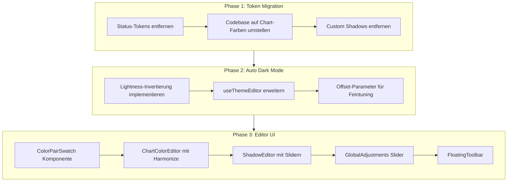

# Theme Editor Redesign

## Architektur-Übersicht



---

## Phase 1: Token-Migration

### 1.1 Status-Tokens aus Codebase entfernen

**Dateien zu ändern:**| Datei | Änderung ||-------|----------|| [src/app/globals.css](src/app/globals.css) | `--success`, `--warning`, `--info` + foregrounds entfernen (Zeilen 36-41, 107-112, 178-183) || [src/hooks/use-theme-editor.ts](src/hooks/use-theme-editor.ts) | Status-Tokens aus Token-Liste entfernen |**Mapping für Codebase-Migration:**

- `bg-success` / `text-success` → `bg-chart-1` / `text-chart-1`
- `bg-warning` / `text-warning` → `bg-chart-2` / `text-chart-2`
- `bg-info` / `text-info` → `bg-chart-3` / `text-chart-3`

**7 Dateien zu migrieren:**

- [src/app/(shell)/account/app-status/page.tsx](<src/app/\\(shell)/account/app-status/page.tsx>)
- [src/app/(shell)/account/profile/page.tsx](<src/app/\\(shell)/account/profile/page.tsx>)
- [src/app/(shell)/about/features/page.tsx](<src/app/\\(shell)/about/features/page.tsx>)
- [src/app/(shell)/about/bugs/page.tsx](<src/app/\\(shell)/about/bugs/page.tsx>)
- [src/app/(shell)/account/payment/page.tsx](<src/app/\\(shell)/account/payment/page.tsx>)
- [src/app/(shell)/account/layout-templates/dashboard/page.tsx](<src/app/\\(shell)/account/layout-templates/dashboard/page.tsx>)
- [src/components/ui/saveable-input.tsx](src/components/ui/saveable-input.tsx)

### 1.2 Custom Shadows entfernen

**Aus [src/app/globals.css](src/app/globals.css) entfernen:**

- `--shadow-panel` (Zeilen 81, 144, 232)
- `--shadow-composer` (Zeilen 84, 147, 235)

**Ersatz:** Standard `shadow-lg` oder `shadow-xl` verwenden.---

## Phase 2: Auto Dark Mode Berechnung

### 2.1 Lightness-Invertierung in useThemeEditor

**Neue Funktion in [src/hooks/use-theme-editor.ts](src/hooks/use-theme-editor.ts):**

```typescript
function invertLightness(oklchValue: string, offset: number = 0): string {
  // Parse: "oklch(0.55 0.15 145)" → { l: 0.55, c: 0.15, h: 145 }
  const match = oklchValue.match(/oklch\(([0-9.]+)\s+([0-9.]+)\s+([0-9.]+)\)/)
  if (!match) return oklchValue

  const l = parseFloat(match[1])
  const c = parseFloat(match[2])
  const h = parseFloat(match[3])

  // Invertiere Lightness: L → 1-L + offset (clamped 0-1)
  const invertedL = Math.max(0, Math.min(1, 1 - l + offset))

  return `oklch(${invertedL.toFixed(2)} ${c} ${h})`
}
```

### 2.2 Auto-Sync beim Token-Edit

Wenn User eine Light-Mode-Farbe ändert, wird Dark-Mode automatisch berechnet:

- `previewToken(name, lightValue)` → berechnet `darkValue = invertLightness(lightValue)`

---

## Phase 3: Editor UI Redesign

### 3.1 Neue Komponenten erstellen

**[src/components/theme/ColorPairSwatch.tsx](src/components/theme/ColorPairSwatch.tsx)** - NEUQuadrat (--radius) mit innerem Rechteck:

- Äußeres Quadrat: `bg-{token}`, 64x64px, border-radius: var(--radius)
- Inneres Rechteck: `bg-{token}-foreground`, 70% Breite, 20% Höhe, im unteren Drittel
- Click öffnet Popover zum Editieren

```javascript
┌────────────────┐
│                │
│   ┌────────┐   │  ← foreground-Rechteck
│   └────────┘   │
└────────────────┘
     ↑ background-Quadrat
```

### 3.2 Responsive Grid für Farbpaare

Die 9 Core Theme Colors sollen responsive umbrechen:| Breakpoint | Spalten | Umbruch ||------------|---------|---------|| `xl` (1280px+) | 9 | Alle in einer Zeile || `lg` (1024px) | 5 + 4 | Nach 5 umbrechen || `md` (768px) | 4 + 3 + 2 | Nach 4 umbrechen || `sm` (640px) | 3 + 3 + 3 | Nach 3 umbrechen |**Tailwind-Klassen:**

```tsx
<div className="grid grid-cols-3 gap-4 sm:grid-cols-3 md:grid-cols-4 lg:grid-cols-5 xl:grid-cols-9">
  {coreColorPairs.map((pair) => (
    <ColorPairSwatch key={pair.token} {...pair} />
  ))}
</div>
```

Sidebar-Farben (4 Paare) umbrechen analog:

- `lg+`: 4 in einer Zeile
- `md`: 2 + 2
- `sm`: 2 + 2

**[src/components/theme/ChartColorEditor.tsx](src/components/theme/ChartColorEditor.tsx)** - NEU

- 5 Farbfelder mit Gradient-Vorschau
- "Harmonize" Button: Verteilt Farben gleichmäßig über Hue (basierend auf chart-1)
- Slider für Hue-Abstand zwischen Farben (z.B. 5°-72°, default 15°)

**[src/components/theme/ShadowEditor.tsx](src/components/theme/ShadowEditor.tsx)** - NEUPro Shadow-Stufe:

- Farbwahl (für rgb() Farbe)
- Slider: X-Offset, Y-Offset, Blur, Spread, Opacity
- Live-Vorschau

**[src/components/theme/GlobalAdjustments.tsx](src/components/theme/GlobalAdjustments.tsx)** - NEUDrei Slider wie bei TweakCN:

- Hue-Shift: -180° bis +180°
- Saturation Multiplier: 0x bis 2x
- Lightness Multiplier: 0.5x bis 1.5x

Diese wirken auf ALLE Farb-Tokens gleichzeitig.**[src/components/theme/FloatingToolbar.tsx](src/components/theme/FloatingToolbar.tsx)** - NEUFixed am unteren Bildschirmrand, nur sichtbar wenn `isDirty`:

- Reset Button (links)
- "Als neues Theme speichern" Button (rechts)

### 3.3 Editor-Layout Struktur

```javascript
┌─────────────────────────────────────────────────────────────┐
│ Tweak the UI                                                │
│ Passe Design-Tokens live an...                              │
├─────────────────────────────────────────────────────────────┤
│                                                             │
│ ▸ CORE THEME COLORS (9 Paare, responsive Grid)              │
│   Desktop (xl):  [bg][fg][cd][po][pr][se][mu][ac][de]       │
│   Laptop (lg):   [bg][fg][cd][po][pr]                       │
│                  [se][mu][ac][de]                           │
│   Tablet (md):   [bg][fg][cd][po]                           │
│                  [pr][se][mu]                               │
│                  [ac][de]                                   │
│                                                             │
│ ▸ BORDERS (3 leere Kreise)                                  │
│   ○ border  ○ input  ○ ring                                │
│                                                             │
│ ▸ CHART COLORS (5 Farben + Controls)                        │
│   [1] [2] [3] [4] [5]  [Harmonize]  Hue-Abstand: ══════○   │
│                                                             │
│ ▸ SIDEBAR COLORS (4 Paare, responsive)                      │
│   [sidebar][sidebar-primary][sidebar-accent][sidebar-muted] │
│   ○ sidebar-border  ○ sidebar-ring                         │
│                                                             │
│ ▸ RADIUS & SPACING (2 Slider)                               │
│   Radius:  ══════════○  0.5rem (8px)                       │
│   Spacing: ══════════○  0.25rem                            │
│                                                             │
│ ▸ TYPOGRAPHY (3 Zeilen mit Letter-Spacing)                  │
│   Sans:  [Inter]            Letter-Spacing: ══════○        │
│   Mono:  [JetBrains Mono]   Letter-Spacing: ══════○        │
│   Serif: [System Serif]     Letter-Spacing: ══════○        │
│                                                             │
│ ▸ SHADOWS (6 Stufen mit Editoren)                           │
│   [xs] [sm] [md] [lg] [xl] [2xl]                           │
│   Color: ■  X: ══○  Y: ══○  Blur: ══○  Spread: ══○        │
│                                                             │
│ ▸ GLOBAL ADJUSTMENTS (3 Master-Slider)                      │
│   Hue-Shift:    ══════════○══════════  0°                  │
│   Saturation:   ══════════○           1.0x                 │
│   Lightness:    ══════════○           1.0x                 │
│                                                             │
└─────────────────────────────────────────────────────────────┘

           ┌─────────────────────────────────────┐
           │  [Zurücksetzen]    [Als Theme speichern]  │  ← Floating
           └─────────────────────────────────────┘
```

---

## Implementierungs-Reihenfolge

1. **Token-Migration** (globals.css + 7 Dateien) - Breaking Change, zuerst machen
2. **Custom Shadows ersetzen** (Stellen finden, auf Standard umstellen)
3. **Dark Mode Auto-Calc** in useThemeEditor implementieren
4. **ColorPairSwatch** Komponente erstellen
5. **ChartColorEditor** mit Harmonize-Logik
6. **ShadowEditor** mit Slidern
7. **GlobalAdjustments** Slider
8. **FloatingToolbar** erstellen
9. **tweak/page.tsx** komplett neu aufbauen mit neuer Struktur
10. **Dokumentation** aktualisieren

---

## Risiken und Abhängigkeiten

- **Breaking Change**: Status-Tokens werden entfernt, alle Verwendungsstellen müssen migriert werden
- **OKLCH-Werte-Manipulation**: Für Lightness-Invertierung und Global Adjustments müssen wir OKLCH-Strings parsen, L/C/H-Werte extrahieren, manipulieren, und wieder zusammenbauen. Da wir konsistent `oklch(L C H)` verwenden, reicht ein einfacher Regex:

  ```typescript
  const match = value.match(/oklch\(([0-9.]+)\s+([0-9.]+)\s+([0-9.]+)\)/)
  // match[1] = L (Lightness), match[2] = C (Chroma), match[3] = H (Hue)
  ```
