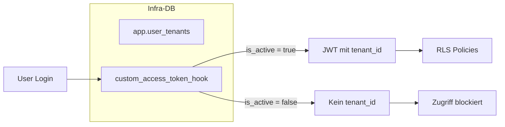
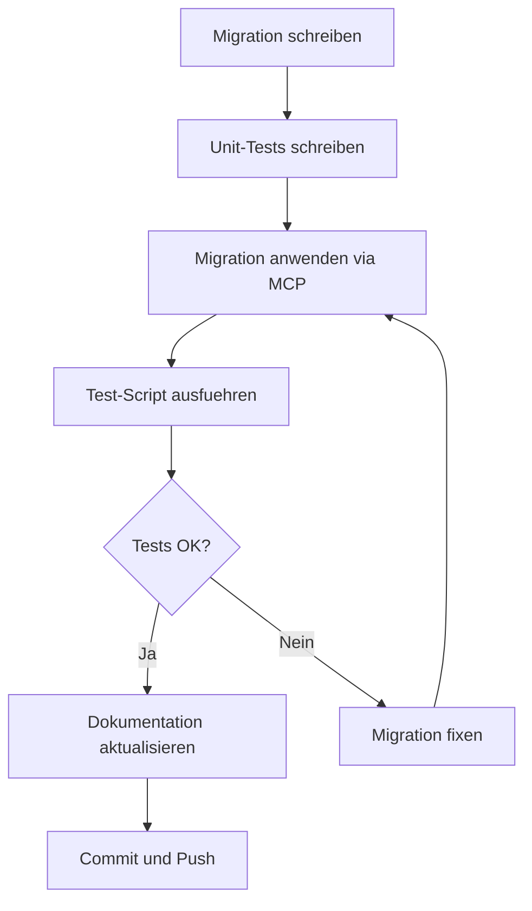

# User-Tenant Aktivierungs-Flag

## Architektur-Entscheidung



**Kernprinzip:** Ein User ohne aktiven Tenant-Eintrag bekommt keinen `tenant_id` Claim im JWT und wird von allen RLS Policies blockiert.

---

## 1. Migration erstellen

Neue Datei: [`supabase/migrations/027_user_tenant_is_active.sql`](supabase/migrations/027_user_tenant_is_active.sql)

**Inhalte:**

1. **Spalte hinzufuegen:**

   ```sql
   ALTER TABLE app.user_tenants
   ADD COLUMN is_active BOOLEAN NOT NULL DEFAULT true;
   ```

2. **Index fuer Performance:**

   ```sql
   CREATE INDEX idx_user_tenants_is_active ON app.user_tenants(is_active);
   ```

3. **Auth Hook anpassen** (`app.custom_access_token_hook`):
   - WHERE-Clause erweitern: `AND ut.is_active = true`
   - Damit bekommen inaktive User keinen `tenant_id` im JWT

4. **Helper-Funktion fuer RLS** (optional, fuer explizite Pruefung):

   ```sql
   CREATE FUNCTION app.is_user_active_in_tenant(user_uuid UUID, tenant_uuid UUID)
   ```

5. **Kommentare und Dokumentation:**
   ```sql
   COMMENT ON COLUMN app.user_tenants.is_active IS 'Ob der User in diesem Tenant aktiv ist. false = temporaer deaktiviert.';
   ```

---

## 2. Unit-Tests (SQL-Struktur)

Neue Datei: [`supabase/migrations/__tests__/027_user_tenant_is_active.test.ts`](supabase/migrations/__tests__/027_user_tenant_is_active.test.ts)

**Test-Kategorien:**

| Test | Prueft |

|------|--------|

| Spalte existiert | `ALTER TABLE` mit `is_active BOOLEAN` |

| Default ist true | `DEFAULT true` |

| Index existiert | `idx_user_tenants_is_active` |

| Auth Hook aktualisiert | `AND ut.is_active = true` in WHERE |

| Helper-Funktion existiert | `app.is_user_active_in_tenant` |

---

## 3. Integrations-Test (SQL-basiert)

Im Migration-File selbst als Kommentar-Block:

```sql
-- ============================================
-- TEST: Verifikation der is_active Logik
-- ============================================
--
-- Test 1: Aktiver User bekommt tenant_id
-- INSERT INTO app.user_tenants (user_id, tenant_id, is_active) VALUES (..., true);
-- SELECT app.custom_access_token_hook(...) -> tenant_id vorhanden
--
-- Test 2: Inaktiver User bekommt KEIN tenant_id
-- UPDATE app.user_tenants SET is_active = false WHERE ...;
-- SELECT app.custom_access_token_hook(...) -> tenant_id NULL
--
-- Test 3: Reaktivierung funktioniert
-- UPDATE app.user_tenants SET is_active = true WHERE ...;
-- SELECT app.custom_access_token_hook(...) -> tenant_id wieder vorhanden
```

---

## 4. Test-Script fuer manuelle Verifikation

Neue Datei: [`scripts/test-user-tenant-activation.mjs`](scripts/test-user-tenant-activation.mjs)

**Ablauf:**

1. Test-User und Test-Tenant erstellen
2. User-Tenant-Zuordnung mit `is_active = true`
3. Auth Hook simulieren, `tenant_id` pruefen
4. `is_active = false` setzen
5. Auth Hook simulieren, `tenant_id` muss NULL sein
6. Aufraeumen

---

## 5. Dokumentation aktualisieren

Datei: [`docs/02_architecture/database-architecture.md`](docs/02_architecture/database-architecture.md)

**Erweiterungen:**

1. Neuer Abschnitt "User-Tenant-Aktivierung"
2. Tabellen-Schema mit `is_active` Spalte
3. Beispiel fuer Admin-Workflow (User deaktivieren)
4. RLS-Verhalten bei inaktiven Usern

---

## 6. Ausfuehrungsreihenfolge



---

## Dateien

| Aktion | Datei |

|--------|-------|

| Erstellen | `supabase/migrations/027_user_tenant_is_active.sql` |

| Erstellen | `supabase/migrations/__tests__/027_user_tenant_is_active.test.ts` |

| Erstellen | `scripts/test-user-tenant-activation.mjs` |

| Aktualisieren | `docs/02_architecture/database-architecture.md` |
