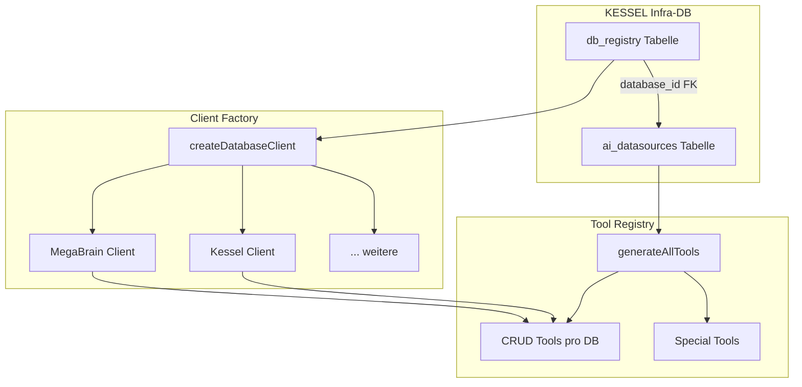

# Multi-Database Architecture

## Übersicht

Die KESSEL-Boilerplate unterstützt eine universelle Multi-Datenbank-Architektur, die es ermöglicht, mehrere Supabase-Instanzen (oder andere Datenbanken) in einer einzigen App zu verwenden. Die AI-Tool-Registry kann dynamisch CRUD-Tools für Tabellen aus verschiedenen Datenbanken generieren.

## Architektur-Diagramm



## Kernkomponenten

### 1. `db_registry` Tabelle

Zentrale Registry für alle registrierten Datenbanken:

```sql
CREATE TABLE db_registry (
  id TEXT PRIMARY KEY,                    -- 'kessel', 'megabrain', etc.
  name TEXT NOT NULL,                     -- 'Infra-DB (KESSEL)'
  description TEXT,
  connection_type TEXT NOT NULL DEFAULT 'supabase',
  is_enabled BOOLEAN DEFAULT true,
  is_default BOOLEAN DEFAULT false,
  env_url_key TEXT,                       -- 'NEXT_PUBLIC_MEGABRAIN_SUPABASE_URL'
  env_anon_key TEXT,                      -- 'NEXT_PUBLIC_MEGABRAIN_SUPABASE_ANON_KEY'
  env_service_key TEXT,                   -- Optional: Service Role Key
  created_at TIMESTAMPTZ DEFAULT NOW(),
  updated_at TIMESTAMPTZ DEFAULT NOW()
);
```

### 2. `ai_datasources` mit `database_id`

Jeder Eintrag in `ai_datasources` referenziert eine Datenbank:

```sql
ALTER TABLE ai_datasources ADD COLUMN database_id TEXT DEFAULT 'kessel';
ALTER TABLE ai_datasources ADD CONSTRAINT fk_ai_datasources_database
  FOREIGN KEY (database_id) REFERENCES db_registry(id) ON DELETE CASCADE;
```

### 3. Client Factory

`src/lib/database/db-registry.ts` stellt Funktionen bereit:

- `loadDatabaseRegistry()` - Lädt alle registrierten DBs
- `createDatabaseClient(dbId)` - Erstellt Client für spezifische DB
- `discoverTables(dbId)` - Entdeckt Tabellen in einer DB
- `syncDatasourcesForDatabase(dbId)` - Synchronisiert Tabellen zu `ai_datasources`

## Eine neue Datenbank hinzufügen

### Schritt 1: Environment-Variablen setzen

Füge die Supabase-Credentials zu `.env.local` hinzu (oder besser: Supabase Vault):

```bash
NEXT_PUBLIC_MEGABRAIN_SUPABASE_URL=https://xxx.supabase.co
NEXT_PUBLIC_MEGABRAIN_SUPABASE_ANON_KEY=eyJxxx...
```

**Wichtig:** Verwende den Supabase Vault für Secrets (siehe `docs/guides/secrets-management.md`).

### Schritt 2: Datenbank registrieren

#### Option A: Über die UI

1. Öffne `/app-verwaltung/datenquellen`
2. Klicke auf "Datenbanken verwalten"
3. Klicke auf "Neue Datenbank hinzufügen" (falls verfügbar)
4. Fülle die Felder aus:
   - **ID:** `megabrain` (eindeutig, keine Leerzeichen)
   - **Name:** `MegaBrain-DB`
   - **Beschreibung:** Optionale Beschreibung
   - **Connection Type:** `supabase`
   - **URL Env Key:** `NEXT_PUBLIC_MEGABRAIN_SUPABASE_URL`
   - **Anon Key Env Key:** `NEXT_PUBLIC_MEGABRAIN_SUPABASE_ANON_KEY`

#### Option B: Direkt in der Datenbank

```sql
INSERT INTO db_registry (
  id, name, description, connection_type,
  env_url_key, env_anon_key, is_enabled
) VALUES (
  'megabrain',
  'MegaBrain-DB',
  'Galaxy-Projektdaten',
  'supabase',
  'NEXT_PUBLIC_MEGABRAIN_SUPABASE_URL',
  'NEXT_PUBLIC_MEGABRAIN_SUPABASE_ANON_KEY',
  true
);
```

### Schritt 3: Tabellen synchronisieren

1. In der UI: Klicke auf "Tabellen verwalten" für die neue DB
2. Klicke auf "Synchronisieren"
3. Wähle die Tabellen aus, die für AI-Tools verfügbar sein sollen
4. Aktiviere die gewünschten Tabellen

**Hinweis:** Für externe Supabase-DBs gibt es zwei Optionen:

#### Option A: RPC-Funktion in der externen DB erstellen

```sql
CREATE OR REPLACE FUNCTION discover_tables()
RETURNS TABLE (table_schema TEXT, table_name TEXT) AS $$
BEGIN
  RETURN QUERY
  SELECT t.table_schema::TEXT, t.table_name::TEXT
  FROM information_schema.tables t
  WHERE t.table_schema = 'public' AND t.table_type = 'BASE TABLE'
  ORDER BY t.table_name;
END;
$$ LANGUAGE plpgsql SECURITY DEFINER;

GRANT EXECUTE ON FUNCTION discover_tables TO authenticated;
GRANT EXECUTE ON FUNCTION discover_tables TO service_role;
```

#### Option B: Discovery-Script verwenden

Falls du keinen Admin-Zugriff auf die externe DB hast, nutze das Discovery-Script:

```bash
node scripts/setup-megabrain-discovery.mjs
```

Das Script:

- Versucht bekannte Tabellennamen zu finden
- Trägt gefundene Tabellen in `ai_datasources` ein
- Setzt `is_enabled = false` als sicheren Default

### Schritt 4: Tabellen aktivieren

1. In der UI: Wähle Tabellen aus der Liste
2. Klicke auf "X Tabellen aktivieren"
3. Setze das `access_level` (none, read, read_write, full) über die Haupttabelle

## Zugriffslevel

| Level        | Beschreibung      | Verfügbare Tools                              |
| ------------ | ----------------- | --------------------------------------------- |
| `none`       | Kein Zugriff      | Keine                                         |
| `read`       | Nur lesen         | `query_*`                                     |
| `read_write` | Lesen + Schreiben | `query_*`, `insert_*`, `update_*`             |
| `full`       | Vollzugriff       | `query_*`, `insert_*`, `update_*`, `delete_*` |

## Sicherheitshinweise

### RLS (Row Level Security)

- **Externe DBs:** Jede externe DB hat ihre eigenen RLS-Policies
- **Anon Key:** Wir nutzen den `anon_key` der externen DB, daher greifen deren RLS-Policies
- **Service Role:** Nur für Admin-Operationen (nicht für normale Tool-Calls)

### Secrets Management

- **Niemals** Secrets direkt in `.env.local` committen
- Verwende den **Supabase Vault** für alle Secrets
- Siehe `docs/guides/secrets-management.md` für Details

### Best Practices

1. **Minimaler Zugriff:** Starte mit `access_level = 'none'` und aktiviere nur benötigte Tabellen
2. **Excluded Columns:** Nutze `excluded_columns` für sensible Felder (Passwörter, Tokens, etc.)
3. **Max Rows:** Setze `max_rows_per_query` für große Tabellen
4. **Audit-Logging:** Alle Tool-Calls werden in `ai_tool_calls` geloggt

## Troubleshooting

### Problem: "Datenbank nicht gefunden"

**Lösung:** Prüfe ob die DB in `db_registry` registriert ist:

```sql
SELECT * FROM db_registry WHERE id = 'megabrain';
```

### Problem: "Environment-Variablen nicht gesetzt"

**Lösung:**

1. Prüfe `.env.local` (oder Vault)
2. Stelle sicher, dass die Variablennamen mit `env_url_key` und `env_anon_key` übereinstimmen
3. Starte den Dev-Server neu

### Problem: "Keine Tabellen gefunden"

**Lösung:**

1. Prüfe ob die RPC-Funktion `discover_tables()` in der externen DB existiert
2. Prüfe ob die DB-Credentials korrekt sind
3. Prüfe RLS-Policies (möglicherweise blockiert)

### Problem: "Tools werden nicht generiert"

**Lösung:**

1. Prüfe ob Tabellen in `ai_datasources` aktiviert sind (`is_enabled = true`)
2. Prüfe ob `access_level != 'none'`
3. Prüfe Logs für Fehler bei Tool-Generierung

## Code-Beispiele

### Client für spezifische DB erstellen

```typescript
import { createDatabaseClient } from "@/lib/database/db-registry"

// KESSEL (Standard)
const kesselClient = await createDatabaseClient("kessel")

// MegaBrain
const megabrainClient = await createDatabaseClient("megabrain")
```

### Tabellen einer DB entdecken

```typescript
import { discoverTables } from "@/lib/database/db-registry"

const tables = await discoverTables("megabrain")
console.log(tables) // [{ table_schema: "public", table_name: "galaxies", ... }, ...]
```

### Tabellen synchronisieren

```typescript
import { syncDatasourcesForDatabase } from "@/lib/database/db-registry"

await syncDatasourcesForDatabase("megabrain")
// Erstellt Einträge in ai_datasources für alle gefundenen Tabellen
```

## UI-Komponenten

### Datenquellen-Seite (`/app-verwaltung/datenquellen`)

Die Hauptseite für das Verwalten aller Datenquellen:

- **Tabellen-Übersicht:** Zeigt alle Tabellen aus allen registrierten Datenbanken
- **Switches:** Aktivieren/Deaktivieren einzelner Tabellen für AI-Tools
- **Zugriffslevel:** Dropdown zum Setzen des Access-Levels

**Hinweis:** Nur Tabellen, die in `ai_datasources` persistiert sind (`isPersisted = true`), können bearbeitet werden. Synthetisch generierte Einträge sind read-only.

### Database Manager Dialog

Öffnet sich über "Datenbanken verwalten":

- Listet alle registrierten Datenbanken aus `db_registry`
- "Tabellen verwalten" Button für jede DB
- Checkboxen zum Aktivieren/Deaktivieren von Tabellen
- "Synchronisieren" Button zum Entdecken neuer Tabellen

## Migrationen

Die Multi-DB-Architektur wird durch folgende Migrationen eingeführt:

- `028_db_registry.sql` - Erstellt `db_registry` Tabelle
- `029_ai_datasources_multi_db.sql` - Erweitert `ai_datasources` um `database_id`
- `030_fix_db_registry_data.sql` - Fügt Standard-Datenbanken hinzu (KESSEL, MegaBrain)
- `031_cleanup_legacy_db_ids.sql` - Bereinigt Legacy-IDs

## Weitere Ressourcen

- [Secrets Management](./secrets-management.md)
- [AI Tool Calling](../../specifications/ai-tool-calling.md)
- [Database Architecture](../../architecture/database-architecture.md)
