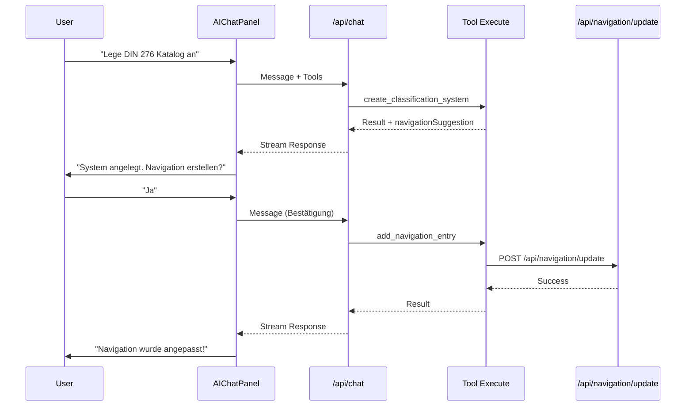

# Navigation-Trigger-System

Das Navigation-Trigger-System ermöglicht es dem AI-Chat, automatisch Navigation-Einträge und Seiten zu erstellen, wenn Tools ausgeführt werden, die Auswirkungen auf die Navigation haben.

## Übersicht

```
┌─────────────────────────────────────────────────────────────┐
│                    navigation.ts                             │
│                 (Single Source of Truth)                     │
│                    statisch, hardcodiert                     │
└─────────────────────┬───────────────────────────────────────┘
                      │ leitet ab
          ┌───────────┼───────────┬───────────┐
          ▼           ▼           ▼           ▼
       URLs      Breadcrumbs   Routen    Seitentitel
```

### Prinzip

1. **Navigation ist statisch** - Die `navigation.ts` bleibt die Single Source of Truth
2. **Tools können Auswirkungen haben** - Manche Tools (z.B. `create_classification_system`) erzeugen Inhalte, die navigierbar sein sollten
3. **Follow-up-Frage** - Nach erfolgreicher Ausführung fragt die AI den User, ob ein Navigation-Eintrag erstellt werden soll
4. **Automatische Generierung** - Bei Zustimmung werden `navigation.ts` und `page.tsx` automatisch angepasst

## Architektur

### Sequenzdiagramm



### Dateien

| Datei                                     | Beschreibung                                        |
| ----------------------------------------- | --------------------------------------------------- |
| `src/lib/ai/types/tool-metadata.ts`       | TypeScript-Interfaces für Tool-Metadata             |
| `src/lib/navigation/code-generator.ts`    | Generiert TypeScript-Code für NavItems und Seiten   |
| `src/app/api/navigation/update/route.ts`  | API-Endpoint zum Erstellen von Navigation-Einträgen |
| `src/lib/ai-chat/navigation-tools.ts`     | `add_navigation_entry` Tool-Definition              |
| `src/lib/ai-chat/classification-tools.ts` | Tools mit `affectsNavigation` Metadata              |

## Verwendung

### Tool mit Navigation-Auswirkungen markieren

```typescript
// In tool-definition.ts
import type { ToolMetadata, NavigationSuggestion } from "@/lib/ai/types/tool-metadata"

export const myTool = {
  description: "Erstellt etwas Neues...",
  inputSchema: z.object({ ... }),
  metadata: {
    affectsNavigation: true,
    category: "my-category",
    isWriteOperation: true,
    navigationSuggestion: (args, result) => ({
      parentPath: "/galaxy/my-section",
      suggestedLabel: args.name,
      suggestedId: `galaxy-my-section-${labelToSlug(args.name)}`,
      icon: "FileText",
    })
  },
  execute: async (args) => {
    // ... Tool-Logik ...

    return {
      success: true,
      data: { ... },
      // NavigationSuggestion im Result
      navigationSuggestion: {
        parentPath: "/galaxy/my-section",
        suggestedLabel: args.name,
        suggestedId: `galaxy-my-section-${labelToSlug(args.name)}`,
        icon: "FileText",
        description: "Beschreibung für die Seite",
      }
    }
  }
}
```

### NavigationSuggestion Interface

```typescript
interface NavigationSuggestion {
  /** Pfad des Parent-Navigation-Items (z.B. "/galaxy/kataloge") */
  parentPath: string

  /** Vorgeschlagenes Label für das neue NavItem (z.B. "DIN 276") */
  suggestedLabel: string

  /** Vorgeschlagene ID für das neue NavItem (z.B. "galaxy-kataloge-din-276") */
  suggestedId: string

  /** Lucide Icon Name als String (z.B. "BookMarked", "FileText") */
  icon?: string

  /** Optionale Beschreibung für die neue Seite */
  description?: string
}
```

## API-Referenz

### POST /api/navigation/update

Erstellt einen neuen Navigation-Eintrag und die zugehörige Seite.

**WICHTIG:** Diese API funktioniert nur im Development-Modus!

#### Request

```json
{
  "parentPath": "/galaxy/kataloge",
  "suggestedLabel": "DIN 276",
  "suggestedId": "galaxy-kataloge-din-276",
  "icon": "BookMarked",
  "description": "Kostengliederung nach DIN 276"
}
```

#### Response (Erfolg)

```json
{
  "success": true,
  "message": "Navigation-Eintrag \"DIN 276\" wurde erstellt",
  "createdFiles": ["src/app/(shell)/galaxy/kataloge/din-276/page.tsx"],
  "modifiedFiles": ["src/config/navigation.ts"],
  "generatedHref": "/galaxy/kataloge/din-276"
}
```

#### Response (Fehler)

```json
{
  "success": false,
  "error": "Navigation-Eintrag existiert bereits",
  "details": ["ID: galaxy-kataloge-din-276"]
}
```

### GET /api/navigation/update

Gibt Informationen über die API zurück (für Debugging).

## System-Prompt Integration

Der System-Prompt in der Chat-API enthält Anweisungen für die AI:

```
## Navigation-Trigger bei create_classification_system
Wenn du ein neues Klassifikationssystem erstellst und das Tool erfolgreich ausgeführt wurde:
1. Teile dem User das Ergebnis mit
2. Frage dann AKTIV: "Soll ich auch einen Navigation-Eintrag für [Name] anlegen?"
3. Wenn der User zustimmt: Rufe das Tool add_navigation_entry auf
```

## Tests

### Unit-Tests

```bash
pnpm test src/lib/navigation/__tests__/code-generator.test.ts
```

Tests abdecken:

- `generateNavItemCode` - Generiert valides TypeScript
- `generatePageTemplate` - Generiert valide React-Komponente
- `findInsertPosition` - Findet korrekte Position in navigation.ts
- `validateNavigationSuggestion` - Validiert Eingaben

### E2E-Tests

```bash
pnpm e2e e2e/navigation-trigger.spec.ts
```

## Troubleshooting

### "API ist nur im Entwicklungsmodus verfügbar"

Die Navigation-Update-API ist aus Sicherheitsgründen nur im Development-Modus verfügbar. Stelle sicher, dass `NODE_ENV=development` gesetzt ist.

### "Konnte Insert-Position nicht finden"

Der `parentPath` muss auf ein existierendes NavItem mit `children`-Array zeigen. Prüfe:

1. Existiert der Pfad in `navigation.ts`?
2. Hat das Parent-Item ein `children`-Array?

### "Navigation-Eintrag existiert bereits"

Ein NavItem mit der gleichen `suggestedId` existiert bereits. Wähle eine andere ID oder lösche den existierenden Eintrag zuerst.

### Icon nicht gefunden

Der Icon-Name muss ein gültiger Lucide-Icon-Name im PascalCase sein (z.B. `BookMarked`, `FileText`). Das Icon wird automatisch zum Import hinzugefügt.

## Erweiterung

### Neue Tools mit Navigation-Auswirkungen

1. Tool-Metadata hinzufügen:

   ```typescript
   metadata: {
     affectsNavigation: true,
     navigationSuggestion: (args, result) => ({ ... })
   }
   ```

2. `NavigationSuggestion` im Tool-Result zurückgeben

3. System-Prompt erweitern (optional, für explizite Anweisungen)

### Custom parentPaths

Um neue Bereiche der Navigation zu unterstützen:

1. Stelle sicher, dass der parentPath in `navigation.ts` existiert
2. Das Parent-Item muss ein `children`-Array haben
3. Passe ggf. den `appRoutesBasePath` in den Optionen an
